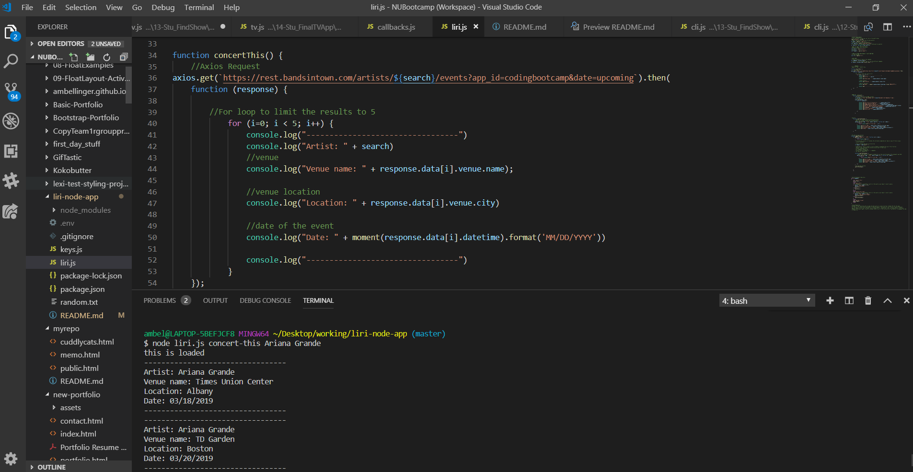
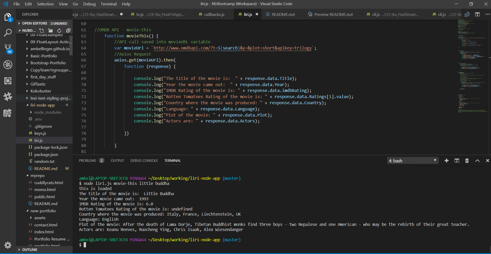
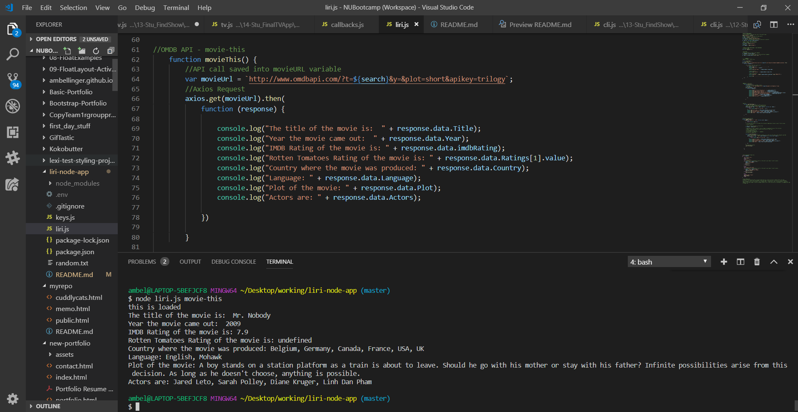
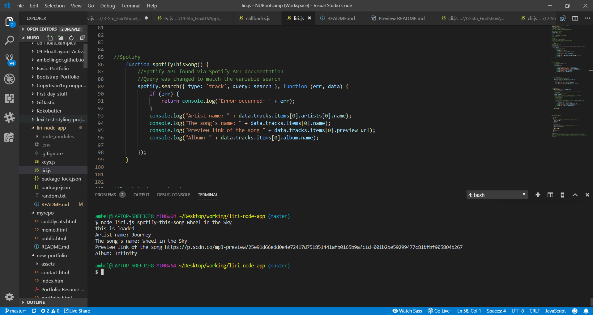
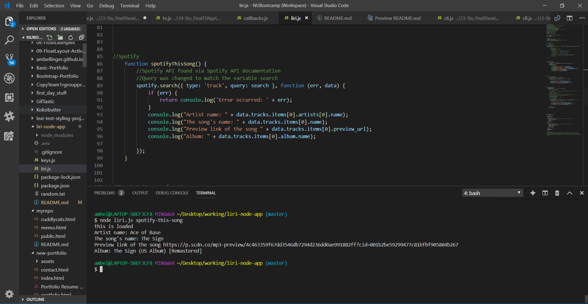
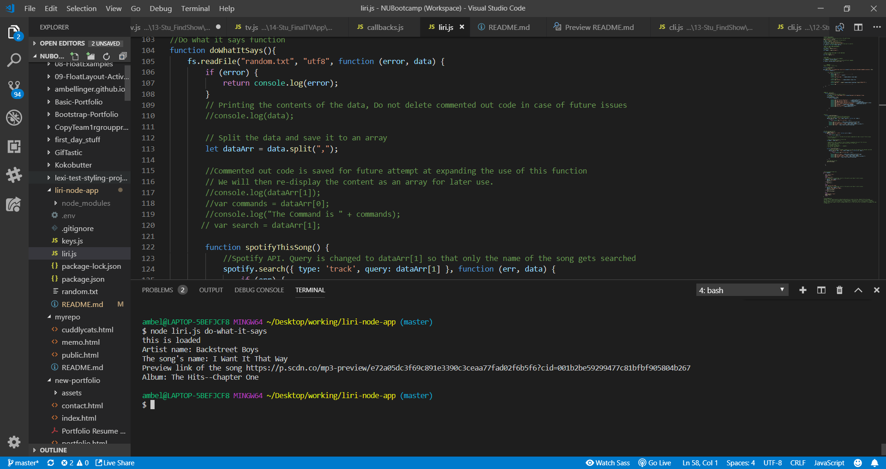

# Liri
Liri operates as a command line version of siri. "She" takes in commands and utilizes APIs to return information. Currently Liri is equiped with basic OMDB (movies), Bands in Town, and Spotify information.

## Technologies Used
* Javascript
* node.JS
* Moment.js
* Axios (NPM install)
* node-spotify API (NPM intall)
* fs (NPM Install)

## APIs Used
* Bands in Town
* Spotify
* OMDB

## Prerequisites
* NPM install (See Tech Used section above)

## How Does It Work?
Information written in the command line is saved.

``` 

//USER INPUT
//Create variables to take in the commands
var commands = process.argv[2];
//Create if or else statement that will do the different commands 
var search = process.argv.slice(3).join(" ");

```

A switch statement uses the command given by the user to run a function. In some cases, if no search information is written after the command, a placeholder search is run instead.

```
switch(commands)
{
    case "concert-this":
    concertThis();
    break;
    case "movie-this":
    //If statements for placeholder results in the event a user doesn't select a movie
    if (search.trim().length === 0) {
        search = "mr+nobody";
        movieThis();
    } else {
        movieThis();
    };
    break;
    case "spotify-this-song":
    //If statements for placeholder results in the event a user doesn't select a movie
    if (search.trim().length === 0) {
        search = "The Sign Ace of Base";
        spotifyThisSong();
    } else {
        spotifyThisSong();
    };
    break;
    case "do-what-it-says":
    doWhatItSays()
    break;
}
```

Once a command is given, the function is run and an API call utilizing axios is requested. The information is then printed into the terminal.

### Results - concert-this



### Results - movie-this



### Results - movie-this w/ Placeholder



### Results - spotify-this-song



### Results - spotify-this-song w/ Placeholder



### Results - do-what-it-says
For the command "do-what-it-says", text written in the random.txt file is plugged into the Spotify function.




## Challenges and Future Improvements
There were many challenges creating this project, particularlly working with the Spotify documentation. It was difficult understanding exactly what was needed to get it to run.

One challenge that remains to be solved is expanding the capabilies of the do-what-it-says function. As of right now, it is only recognizes the spotify-this-song command. I believe an if/else or switch statement will be necessary (the possible hows and what has already been tried can be found at the bottom of liri.js)

Commented out code that hasn't been deleted has been saved for this particular reason.

## Acknowlegments 
Although this is merely a homework assignment, I want to acknowledge the help I recieved from the TAs and from my fellow students especially Jenina who helped me understand the spotify API. :sparkles: